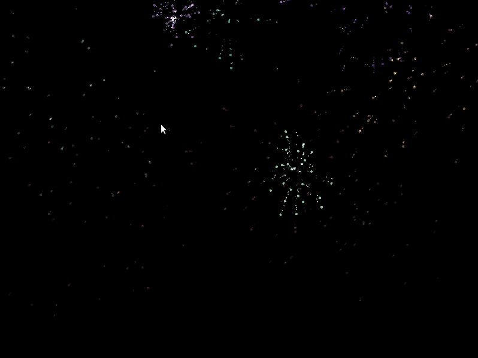

# Fireworks

A simple fireworks simulator using OpenGL 3.1 and SDL2. All particles are rendered from circles, with a trailing effect created from generating particles at a fraction of the source object's velocity. 

## Example

